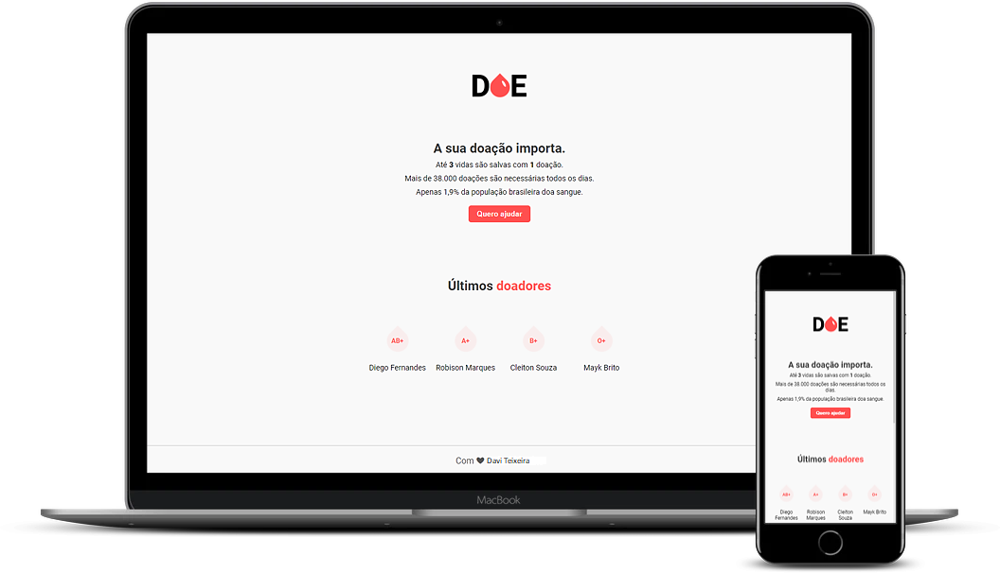

<h1 align="center">
  
</h1>

<p align="center">
  
  
  
  
  <a href="https://github.com/daviteixeira-btm/DOE/commits">
    
  </a>
  
  

  
	 
</p>
<p align="center">
  <a href="#-sobre-o-projeto">Sobre o projeto</a>&nbsp;&nbsp;&nbsp;|&nbsp;&nbsp;&nbsp;
  <a href="#-tecnologias">Tecnologias</a>&nbsp;&nbsp;&nbsp;|&nbsp;&nbsp;&nbsp;
  <a href="#-instalação-execução-e-desenvolvimento">Instalação, execução e desenvolvimento</a>&nbsp;&nbsp;&nbsp;|&nbsp;&nbsp;&nbsp;
  <a href="#-como-contribuir">Como contribuir</a>&nbsp;&nbsp;&nbsp;|&nbsp;&nbsp;&nbsp;
  <a href="#-license">License</a>
</p>



## 👨🏻‍💻 Sobre o projeto
<p>
	Um sistema de cadastro de doadores de sangue. Aplicação web criada a partir da 3ª MaratonaDev da Rocketseat. 
</p>

## 🚀 Tecnologias

- [Express](https://expressjs.com/pt-br/)
- [NodeJs](https://nodejs.org/en/)
- [Nodemon](https://www.npmjs.com/package/nodemon)
- [Nunjucks](https://mozilla.github.io/nunjucks/)
- [PostgreSQL](https://www.postgresql.org/)
- [Postbird](https://www.electronjs.org/apps/postbird)

## 💻 Instalação, execução e desenvolvimento

### Pré-requisitos

- [npm](https://www.npmjs.com/)

### Web
```bash
# Instale as dependências
$ npm install

# Tudo pronto para iniciar a aplicação web
$ npm start
```
### Docker Postgrees
```bash
docker run --name some-postgres -e POSTGRES_PASSWORD=1234 -d postgres
```
### SQL
```sql

CREATE TABLE public.donors (
	id int4 NOT NULL,
	"name" varchar(250) NULL,
	email varchar(250) NULL,
	blood varchar(250) NULL,
	CONSTRAINT donors_pk PRIMARY KEY (id)
);
```
## 🤔 Como contribuir

**Faça um fork deste repositório e siga os passos a baixo**

```bash
# Clone seu fork
$ git clone seu-fork-url && cd NOME_DO_REPO

# Crie uma branch com sua feature
$ git checkout -b my-feature

# Faça commit das suas alterações
$ git commit -m 'feat: My new feature'

# Envie o código para sua remote branch
$ git push origin my-feature
```
Despois que sua pull request for merged, você pode deletar sua branch

## 📝 License

Esse projeto possui uma Licensa MIT License - veja o arquivo [LICENSE](./LICENSE) para mais detalhes.

---

<div align="center">

Feito com ❤️ por Davi Teixeira

</div>
